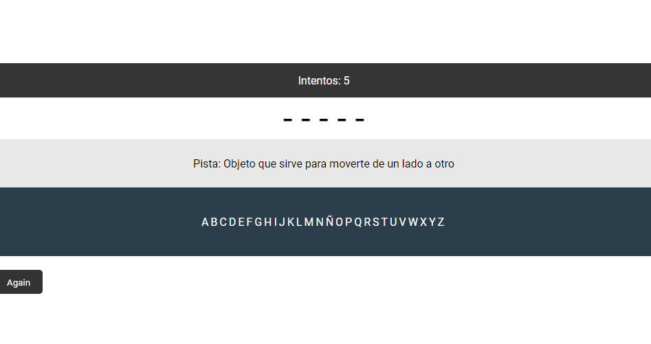
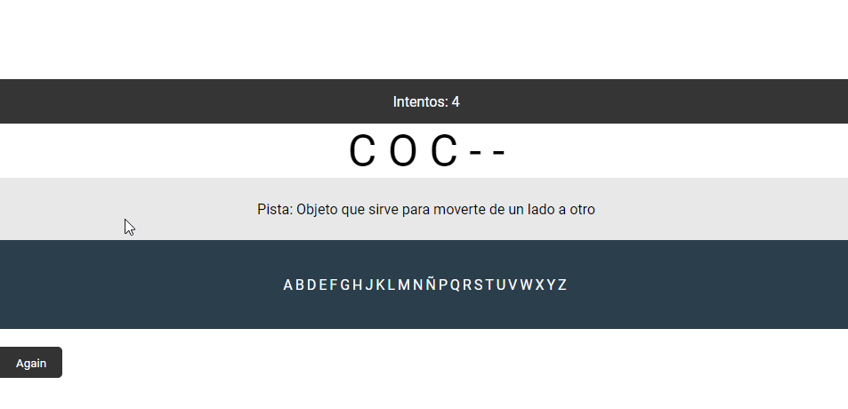

# El ahorcado

Este sencillo repositorio contiene el código básico para la creación del juego de "El ahorcado", hecho completamente con JS.

### Tecnologías
- HTML 5.
- CSS.
- JS.
- JQUERY.
- Bootstrap 4.

### Imágenes

El funcionamiento es sencillo: tienes que dar click en las letras hasta que aciertes la palabra, **para ello tienes 5 intentos**, una vez terminados los intentos, tendrás que volver a empezar. Cuando aciertes la palabra, simplemente, vuelve a empezar.

